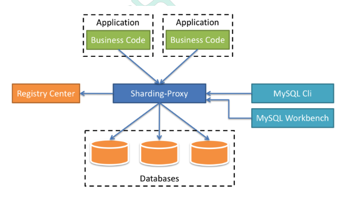

# Sharding Sphere


## 1. 背景

数据库数据量不可控的，随着时间和业务发展，造成表里面数据越来越多，如果再去对数 据库表 curd 操作时候，造成性能问题。


### 1.1 分库分表

数据库中的数据量不一定是可控的，在未进行分库分表的情况下，随着时间和业务的发展， 库中的表会越来越多，表中的数据量也会越来越大，相应地，数据操作，增删改查的开销 也会越来越大;另外，**由于无法进行分布式式部署，而一台服务器的资源(CPU、磁盘、内 存、IO 等)是有限的，最终数据库所能承载的数据量、数据处理能力都将遭遇瓶颈**。

分库分表就是为了解决由于数据量过大而导致数据库性能降低的问题，将原来独立的数据 库拆分成若干数据库组成，将数据大表拆分成若干数据表组成，使得单一数据库、单一数 据表的数据量变小，从而达到提升数据库性能的目的。

分库分表有两种方式

+ 垂直切分:垂直分表和垂直分库
+ 水平切分:水平分表和水平分库


**垂直切分的优点**

+ 拆分后业务清晰，系统之间进行整合或扩展很容易。
+ 按照成本、应用的等级、应用的类型等奖表放到不同的机器上，便于管理，数据维护 简单。

**垂直切分的缺点**

+ 部分业务表无法关联(Join), 只能通过接口方式解决，提高了系统的复杂度。
+ 受每种业务的不同限制，存在单库性能瓶颈，不易进行数据扩展和提升性能。 (3)事务处理变得复杂。


**水平切分的优点**

+ 单库单表的数据保持在一定的量级，有助于性能的提高。 
+ 切分的表的结构相同，应用层改造较少，只需要增加路由规则即可。
+ 提高了系统的稳定性和负载能力。

**水平切分的缺点**

+ 切分后，数据是分散的，很难利用数据库的 Join 操作，跨库 Join 性能较差。
+ 分片事务的一致性难以解决，数据扩容的难度和维护量极大。


#### 垂直分表

操作数据库中某张表，把这张表中一部分字段数据存到一张新表里面，再把这张表另一 部分字段数据存到另外一张表里面


#### 垂直分库

把单一数据库按照业务进行划分，专库专表


#### 水平分表


#### 水平分库


#### 技术问题

应用

+ 在数据库设计时候考虑垂直分库和垂直分表
+ 随着数据库数据量增加，不要马上考虑做水平切分，首先考虑缓存处理，读写分离，使 用索引等等方式，如果这些方式不能根本解决问题了，再考虑做水平分库和水平分表

数据源

+ 跨节点连接查询问题(分页、排序)

+ 多数据源管理问题


### 1.2 ShardingSphere

+ 一套开源的分布式数据库中间件解决方案
+ 有三个产品:Sharding-JDBC，Sharding-Proxy，Sharding-Sidecar
+ 定位为关系型数据库中间件，合理在分布式环境下使用关系型数据库操作

ShardingSphere 定位为**关系型数据库中间件**，旨在充分合理地在分布式的场景下利用关系 型数据库的计算和存储能力，而并非实现一个全新的关系型数据库。它通过关注不变，进 而抓住事物本质。关系型数据库当今依然占有巨大市场，是各个公司核心业务的基石，未 来也难于撼动，我们目前阶段更加关注在原有基础上的增量，而非颠覆。


## 2. Sharding-JDBC简介

Sharding-JDBC 是 ShardingSphere 的第一个产品，也是 ShardingSphere 的前身。 它定 位为轻量级 Java 框架，在 **Java 的 JDBC 层提供的额外服务。它使用客户端直连数据库， 以 jar 包形式提供服务，无需额外部署和依赖，可理解为增强版的 JDBC 驱动**，完全兼容 JDBC 和各种 ORM 框架。

通过Sharding-JDBC，**应用可以透明的使 用jdbc访问已经分库分表、读写分离的多个数据源**，而不用关心数据源的数量以及数据如何分 布。

- 适用于任何基于 JDBC 的 ORM 框架，如:JPA, Hibernate, Mybatis, Spring JDBC Template 或直接使用 JDBC。
- 支持任何第三方的数据库连接池，如:DBCP, C3P0, BoneCP, Druid, HikariCP等
- 支持任意实现 JDBC 规范的数据库。目前支持 MySQL，Oracle，SQLServer, PostgreSQL 以及任何遵循 SQL92 标准的数据库。


```xml
<dependency>
  <groupId>com.alibaba</groupId>
  <artifactId>druid-spring-boot-starter</artifactId>
  <version>1.1.20</version>
</dependency>
<dependency>
  <groupId>mysql</groupId>
  <artifactId>mysql-connector-java</artifactId>
</dependency>
<dependency>
  <groupId>org.apache.shardingsphere</groupId>
  <artifactId>sharding-jdbc-spring-boot-starter</artifactId>
  <version>4.0.0-RC1</version>
</dependency>
<dependency>
  <groupId>com.baomidou</groupId>
  <artifactId>mybatis-plus-boot-starter</artifactId>
  <version>3.0.5</version>
</dependency>
```


### 2.1 水平分表

创建数据库和数据库表

+ 创建数据库 course_db
+ 在数据库创建两张表 course_1 和 course_2

```properties
# 水平分表
# 配置数据源，给数据源起名称
spring.shardingsphere.datasource.names=m1

# 一个实体类对应两张表，覆盖
spring.main.allow-bean-definition-overriding=true

#配置数据源具体内容，包含连接池，驱动，地址，用户名和密码
spring.shardingsphere.datasource.m1.type=com.alibaba.druid.pool.DruidDataSource
spring.shardingsphere.datasource.m1.driver-class-name=com.mysql.cj.jdbc.Driver
spring.shardingsphere.datasource.m1.url=jdbc:mysql://localhost:3306/course_db?serverTimezone=GMT%2B8
spring.shardingsphere.datasource.m1.username=root
spring.shardingsphere.datasource.m1.password=root

#指定course表分布情况，配置表在哪个数据库里面，表名称都是什么  m1.course_1 , m1.course_2
spring.shardingsphere.sharding.tables.course.actual-data-nodes=m1.course_$->{1..2}

# 指定course表里面主键cid 生成策略  SNOWFLAKE
spring.shardingsphere.sharding.tables.course.key-generator.column=cid
spring.shardingsphere.sharding.tables.course.key-generator.type=SNOWFLAKE

# 指定分片策略  约定cid值偶数添加到course_1表，如果cid是奇数添加到course_2表
spring.shardingsphere.sharding.tables.course.table-strategy.inline.sharding-column=cid
spring.shardingsphere.sharding.tables.course.table-strategy.inline.algorithm-expression=course_$->{cid % 2 + 1}

# 打开sql输出日志
spring.shardingsphere.props.sql.show=true
```


### 2.2 水平分库

创建数据库和数据库表

+ 创建数据库 edu_db_1 包括两张表 course_1 和 course_2
+ 创建数据库 edu_db_2 包括两张表 course_1 和 course_2

```properties
# 水平分库，配置两个数据源
spring.shardingsphere.datasource.names=m1,m2

spring.main.allow-bean-definition-overriding=true

#配置第一个数据源具体内容，包含连接池，驱动，地址，用户名和密码
spring.shardingsphere.datasource.m1.type=com.alibaba.druid.pool.DruidDataSource
spring.shardingsphere.datasource.m1.driver-class-name=com.mysql.cj.jdbc.Driver
spring.shardingsphere.datasource.m1.url=jdbc:mysql://localhost:3306/edu_db_1?serverTimezone=GMT%2B8
spring.shardingsphere.datasource.m1.username=root
spring.shardingsphere.datasource.m1.password=root

#配置第二个数据源具体内容，包含连接池，驱动，地址，用户名和密码
spring.shardingsphere.datasource.m2.type=com.alibaba.druid.pool.DruidDataSource
spring.shardingsphere.datasource.m2.driver-class-name=com.mysql.cj.jdbc.Driver
spring.shardingsphere.datasource.m2.url=jdbc:mysql://localhost:3306/edu_db_2?serverTimezone=GMT%2B8
spring.shardingsphere.datasource.m2.username=root
spring.shardingsphere.datasource.m2.password=root

#指定数据库分布情况，数据库里面表分布情况
# m1  m2    course_1 course_2
spring.shardingsphere.sharding.tables.course.actual-data-nodes=m$->{1..2}.course_$->{1..2}

# 指定course表里面主键cid 生成策略  SNOWFLAKE
spring.shardingsphere.sharding.tables.course.key-generator.column=cid
spring.shardingsphere.sharding.tables.course.key-generator.type=SNOWFLAKE

# 指定数据库分片策略 约定user_id是偶数添加m1，是奇数添加m2
spring.shardingsphere.sharding.tables.course.database-strategy.inline..sharding-column=user_id
spring.shardingsphere.sharding.tables.course.database-strategy.inline.algorithm-expression=m$->{user_id % 2 + 1}

# 指定表分片策略  约定cid值偶数添加到course_1表，如果cid是奇数添加到course_2表
spring.shardingsphere.sharding.tables.course.table-strategy.inline.sharding-column=cid
spring.shardingsphere.sharding.tables.course.table-strategy.inline.algorithm-expression=course_$->{cid % 2 + 1}


# 打开sql输出日志
spring.shardingsphere.props.sql.show=true
```


### 2.3 垂直分库

创建数据库和数据库表

+ 创建user_db包括t_user表
+ 创建edu_db包括course表

```properties
# 垂直分库
spring.shardingsphere.datasource.names=m1,m2,m0

# 一个实体类对应两张表，覆盖
spring.main.allow-bean-definition-overriding=true

#配置第一个数据源具体内容，包含连接池，驱动，地址，用户名和密码
spring.shardingsphere.datasource.m1.type=com.alibaba.druid.pool.DruidDataSource
spring.shardingsphere.datasource.m1.driver-class-name=com.mysql.cj.jdbc.Driver
spring.shardingsphere.datasource.m1.url=jdbc:mysql://localhost:3306/edu_db_1?serverTimezone=GMT%2B8
spring.shardingsphere.datasource.m1.username=root
spring.shardingsphere.datasource.m1.password=root

#配置第二个数据源具体内容，包含连接池，驱动，地址，用户名和密码
spring.shardingsphere.datasource.m2.type=com.alibaba.druid.pool.DruidDataSource
spring.shardingsphere.datasource.m2.driver-class-name=com.mysql.cj.jdbc.Driver
spring.shardingsphere.datasource.m2.url=jdbc:mysql://localhost:3306/edu_db_2?serverTimezone=GMT%2B8
spring.shardingsphere.datasource.m2.username=root
spring.shardingsphere.datasource.m2.password=root

#配置第三个数据源具体内容，包含连接池，驱动，地址，用户名和密码
spring.shardingsphere.datasource.m0.type=com.alibaba.druid.pool.DruidDataSource
spring.shardingsphere.datasource.m0.driver-class-name=com.mysql.cj.jdbc.Driver
spring.shardingsphere.datasource.m0.url=jdbc:mysql://localhost:3306/user_db?serverTimezone=GMT%2B8
spring.shardingsphere.datasource.m0.username=root
spring.shardingsphere.datasource.m0.password=root

# 配置user_db数据库里面t_user 专库专表
spring.shardingsphere.sharding.tables.t_user.actual-data-nodes=m$->{0}.t_user

spring.shardingsphere.sharding.tables.t_user.key-generator.column=user_id
spring.shardingsphere.sharding.tables.t_user.key-generator.type=SNOWFLAKE

spring.shardingsphere.sharding.tables.t_user.table-strategy.inline.sharding-column=user_id
spring.shardingsphere.sharding.tables.t_user.table-strategy.inline.algorithm-expression=t_user


# 配置edu_db数据库里面course专库专表
spring.shardingsphere.sharding.tables.course.actual-data-nodes=m$->{1..2}.course_$->{1..2}

spring.shardingsphere.sharding.tables.course.key-generator.column=cid
spring.shardingsphere.sharding.tables.course.key-generator.type=SNOWFLAKE

spring.shardingsphere.sharding.tables.course.database-strategy.inline..sharding-column=user_id
spring.shardingsphere.sharding.tables.course.database-strategy.inline.algorithm-expression=m$->{user_id % 2 + 1}

spring.shardingsphere.sharding.tables.course.table-strategy.inline.sharding-column=cid
spring.shardingsphere.sharding.tables.course.table-strategy.inline.algorithm-expression=course_$->{cid % 2 + 1}

# 打开sql输出日志
spring.shardingsphere.props.sql.show=true
```


### 2.3 公共表

公共表

+ 存储固定数据的表，表数据很少发生变化，查询时候经常进行关联
+ 在每个数据库中创建出相同结构公共表

在多个数据库都创建相同结构公共表

```properties
# 公共表
spring.shardingsphere.datasource.names=m1,m2,m0

# 一个实体类对应两张表，覆盖
spring.main.allow-bean-definition-overriding=true

#配置第一个数据源具体内容，包含连接池，驱动，地址，用户名和密码
spring.shardingsphere.datasource.m1.type=com.alibaba.druid.pool.DruidDataSource
spring.shardingsphere.datasource.m1.driver-class-name=com.mysql.cj.jdbc.Driver
spring.shardingsphere.datasource.m1.url=jdbc:mysql://localhost:3306/edu_db_1?serverTimezone=GMT%2B8
spring.shardingsphere.datasource.m1.username=root
spring.shardingsphere.datasource.m1.password=root

#配置第二个数据源具体内容，包含连接池，驱动，地址，用户名和密码
spring.shardingsphere.datasource.m2.type=com.alibaba.druid.pool.DruidDataSource
spring.shardingsphere.datasource.m2.driver-class-name=com.mysql.cj.jdbc.Driver
spring.shardingsphere.datasource.m2.url=jdbc:mysql://localhost:3306/edu_db_2?serverTimezone=GMT%2B8
spring.shardingsphere.datasource.m2.username=root
spring.shardingsphere.datasource.m2.password=root

#配置第三个数据源具体内容，包含连接池，驱动，地址，用户名和密码
spring.shardingsphere.datasource.m0.type=com.alibaba.druid.pool.DruidDataSource
spring.shardingsphere.datasource.m0.driver-class-name=com.mysql.cj.jdbc.Driver
spring.shardingsphere.datasource.m0.url=jdbc:mysql://localhost:3306/user_db?serverTimezone=GMT%2B8
spring.shardingsphere.datasource.m0.username=root
spring.shardingsphere.datasource.m0.password=root

# 配置公共表
spring.shardingsphere.sharding.broadcast-tables=t_udict
spring.shardingsphere.sharding.tables.t_udict.key-generator.column=dictid
spring.shardingsphere.sharding.tables.t_udict.key-generator.type=SNOWFLAKE
```


### 2.4 读写分离

为了确保数据库产品的稳定性，很多数据库拥有双机热备功能。也就是，第一台数据库服 务器，是对外提供增删改业务的生产服务器;第二台数据库服务器，主要进行读的操作。

+ 让主数据库处理事务性增、改、删操作
+ 从数据库处理SELECT查询操作

```properties
spring.shardingsphere.datasource.s0.type=com.alibaba.druid.pool.DruidDataSourc e spring.shardingsphere.datasource.s0.driver-class-name=com.mysql.cj.jdbc.Driver spring.shardingsphere.datasource.s0.url=jdbc:mysql://localhost:3307/user_db?se rverTimezone=GMT%2B8
spring.shardingsphere.datasource.s0.username=root
  
spring.shardingsphere.datasource.s0.password=root
# 主库从库逻辑数据源定义 ds0 为 user_db
spring.shardingsphere.sharding.master-slave-rules.ds0.master-data-source- name=m0 spring.shardingsphere.sharding.master-slave-rules.ds0.slave-data-source- names=s0
```


## 3. Sharding-Proxy简介

Sharding-Proxy 是 ShardingSphere 的第二个产品。 它定位为透明化的数据库代理端，提 供封装了数据库二进制协议的服务端版本，用于完成对异构语言的支持。 目前先提供 MySQL/PostgreSQL 版本，它可以使用任何兼容 MySQL/PostgreSQL 协议的访问客户端(如: MySQL Command Client, MySQL Workbench, Navicat 等)操作数据，对 DBA 更加友好。

- 向应用程序完全透明，可直接当做 MySQL/PostgreSQL 使用。
- 适用于任何兼容 MySQL/PostgreSQL 协议的的客户端



### 3.1 安装

下 载 Sharding-Proxy 的 最 新 发 行 版 ， 地 址 :https://github.com/sharding-sphere/sharding-sphere-doc/raw/master/dist/sharding-proxy-3.0.0.tar.gz

上传服务器，解压，进入 conf 目录，有 2 个重要的配置文件:server.yaml 和 config- sharding.yaml


### 3.2 配置

#### Server.yaml

```yaml
authentication:
  users:
    root:
      password: root
    sharding:
      password: sharding 
      authorizedSchemas: sharding_db

props:
  max.connections.size.per.query: 1
  acceptor.size: 16  # 用于设置接收客户端请求的工作线程个数，默认为 CPU 核数*2
  executor.size: 16  # 工作线程数量，默认值: CPU 核数
  proxy.frontend.flush.threshold: 128  # The default value is 128.
    # LOCAL: Proxy will run with LOCAL transaction.
    # XA: Proxy will run with XA transaction.
    # BASE: Proxy will run with B.A.S.E transaction.
  proxy.transaction.type: LOCAL
  proxy.opentracing.enabled: false  #是否开启事务, 目前仅支持 XA 事务，默认为不开启
  query.with.cipher.column: true
  proxy.opentracing.enabled: false # 是否开启链路追踪功能，默认为不开启
	sql.show: true # 是否开启 SQL 显示，默认值: false

```


#### config-sharding.yaml

```yaml
schemaName: sharding_db

dataSources:
  ds_0:
    url: jdbc:mysql://127.0.0.1:3306/edu_db_1?serverTimezone=UTC&useSSL=false
    username: root
    password: root
    connectionTimeoutMilliseconds: 30000
    idleTimeoutMilliseconds: 60000
    maxLifetimeMilliseconds: 1800000
    maxPoolSize: 50
  ds_1:
    url: jdbc:mysql://127.0.0.1:3306/edu_db_2?serverTimezone=UTC&useSSL=false
    username: root
    password: root
    connectionTimeoutMilliseconds: 30000
    idleTimeoutMilliseconds: 60000
    maxLifetimeMilliseconds: 1800000
    maxPoolSize: 50

shardingRule:
  tables:
    t_order:
      actualDataNodes: ds_${0..1}.t_order_${1..2}
      tableStrategy:
        inline:
          shardingColumn: order_id
          algorithmExpression: t_order_${order_id % 2 + 1}
      keyGenerator:
        type: SNOWFLAKE
        column: order_id
  bindingTables:
    - t_order
  defaultDatabaseStrategy:
    inline:
      shardingColumn: user_id
      algorithmExpression: ds_${user_id % 2}
  defaultTableStrategy:
    none:
```


#### config-master-slave.yaml

配置与读写分离

```yaml
schemaName: master_slave_db

dataSources: master_ds:
	url: jdbc:mysql://127.0.0.1:3306/demo_ds_master?serverTimezone=UTC&useSSL=false username: root
	password: root
	connectionTimeoutMilliseconds: 30000
	idleTimeoutMilliseconds: 60000 maxLifetimeMilliseconds: 1800000 maxPoolSize: 50

slave_ds_0:  
  url: jdbc:mysql://127.0.0.1:3306/demo_ds_slave_0?serverTimezone=UTC&useSSL=false username: root
  password: root
  connectionTimeoutMilliseconds: 30000
  idleTimeoutMilliseconds: 60000 maxLifetimeMilliseconds: 1800000 maxPoolSize: 50
slave_ds_1:
  url: jdbc:mysql://127.0.0.1:3306/demo_ds_slave_1?serverTimezone=UTC&useSSL=false username: root
  password: root
  connectionTimeoutMilliseconds: 30000
  idleTimeoutMilliseconds: 60000
  maxLifetimeMilliseconds: 1800000
  maxPoolSize: 50

masterSlaveRule:
  name: ms_ds 
  masterDataSourceName: master_ds 
  slaveDataSourceNames:
    - slave_ds_0
    - slave_ds_1
```


### 3.3 Spring Boot

```XML
<!-- druid 连接池 -->
<dependency> 
	<groupId>com.alibaba</groupId> 
	<artifactId>druid-spring-boot-starter</artifactId> 
	<version>1.1.9</version>
</dependency>
<dependency> 
  <groupId>io.shardingsphere</groupId> 
  <artifactId>sharding-transaction-spring</artifactId>
  <version>3.1.0</version>
</dependency>
<dependency> 
  <groupId>org.springframework.boot</groupId> 
  <artifactId>spring-boot-starter-aop</artifactId> 
</dependency>
```

```properties
spring.datasource.type=com.alibaba.druid.pool.DruidDataSource spring.datasource.driver-class-name=com.mysql.jdbc.Driver
spring.datasource.url=jdbc:mysql://localhost:3307/sharding_db?useServerPrepStmts=true&c achePrepStmts=true
spring.datasource.username=root spring.datasource.password=123456 #spring.datasource.druid.driver-class-name=com.mysql.cj.jdbc.Driver #初始化时建立物理连接的个数
spring.datasource.druid.initial-size=3
#最小连接池数量
spring.datasource.druid.min-idle=3
#最大连接池数量
spring.datasource.druid.max-active=10
#获取连接时最大等待时间
spring.datasource.druid.max-wait=60000
```

